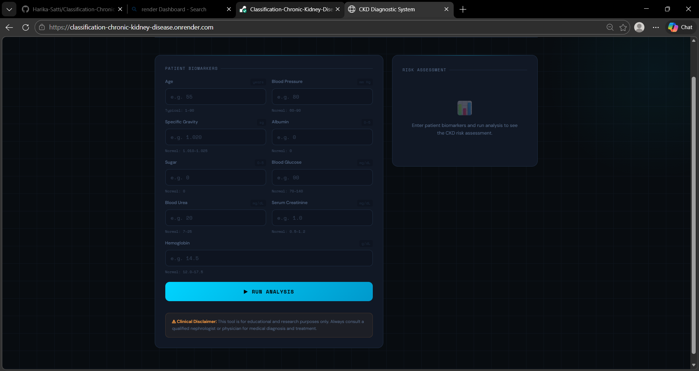
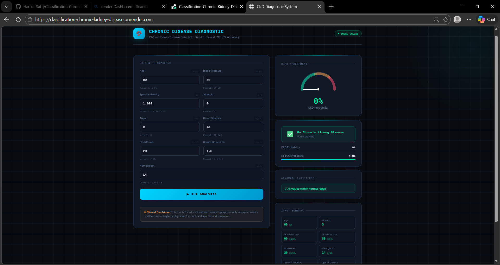
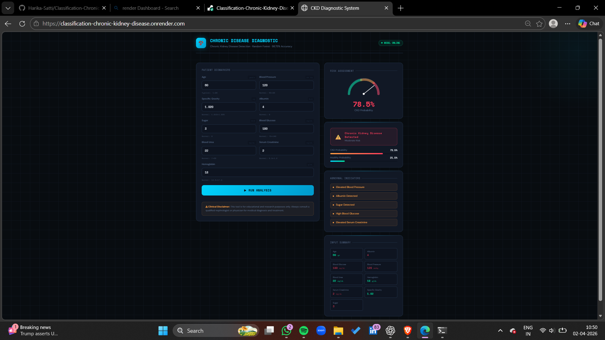
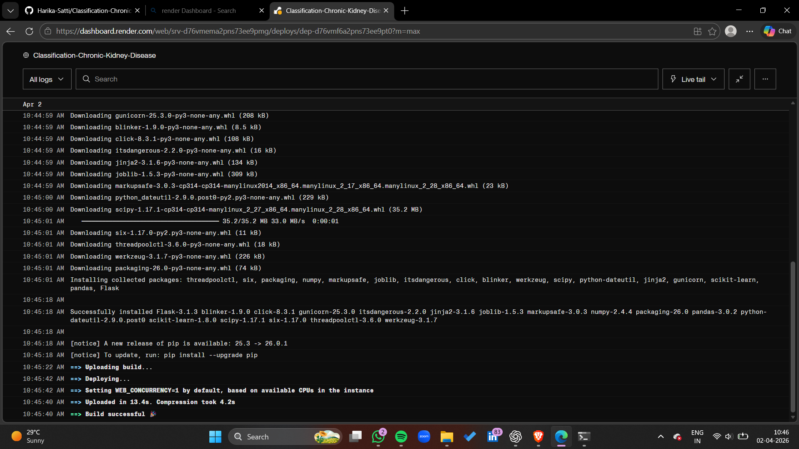

<h1 align="center">🫘 CKD Diagnostic System</h1>

  

  
  
  
  
  
  
  

## 🧠 About the Project

An AI-powered web application that predicts Chronic Kidney Disease (CKD) using machine learning.  
It uses a trained Random Forest model and provides instant predictions through a Flask-based dashboard and Deployed in Render

## 📸 Screenshots

### Dashboard

### Prediction Result

### Live Deployment

## 🎯 Features

- CKD prediction using Machine Learning
- Real-time prediction system
- Probability-based health risk output
- Medical dashboard UI
- Flask backend integration
- Render deployment ready

## 🧪 Input Features

- Age
- Blood Pressure
- Specific Gravity
- Albumin
- Sugar
- Blood Glucose Random
- Blood Urea
- Serum Creatinine
- Hemoglobin

## 📊 Sample Prediction Output

### 🧾 Input Values
| Feature              | Value |
|---------------------|------|
| Age                 | 58   |
| Blood Pressure      | 90   |
| Specific Gravity    | 1.010|
| Albumin             | 3    |
| Sugar               | 2    |
| Blood Glucose       | 180  |
| Blood Urea          | 60   |
| Serum Creatinine    | 2.5  |
| Hemoglobin          | 9.5  |

### 🧠 Prediction Result

- **CKD Probability:** 87%
- **Healthy Probability:** 13%
- **Prediction:** ⚠️ Chronic Kidney Disease Detected
- **Risk Level:** High Risk

### ⚠️ Abnormal Indicators

- Elevated Blood Glucose
- High Blood Urea
- High Serum Creatinine
- Low Hemoglobin
- Presence of Albumin and Sugar

## 📊 Sample Healthy Output

- **CKD Probability:** 5%
- **Healthy Probability:** 95%
- **Prediction:** ✅ No Chronic Kidney Disease
- **Risk Level:** Low Risk

### ✅ Interpretation

The model predicts a **high likelihood of Chronic Kidney Disease** based on abnormal biomarker values.  
Immediate medical consultation is strongly recommended.

## 🧠 Model Details

- Algorithm: Random Forest Classifier
- Library: Scikit-learn
- Dataset: CKD Dataset (UCI / Kaggle)
- Output: CKD / Not CKD

## 📊 Accuracy

  

## 🏗️ Project Structure

CKD-Project/
├── app.py
├── model.pkl
├── requirements.txt
├── templates/
│   └── index.html
├── static/
│   ├── css/
│   ├── js/
├── screenshots
│   ├── dashboard.png
│   ├── result.png
│   └── analysis.png

## ⚙️ Run Locally

git clone https://github.com/Harika-Satti/Classification-Chronic-Kidney-Disease.git
cd Classification-Chronic-Kidney-Disease
pip install -r requirements.txt
python app.py

## 🚀 Deploy on Render

Build Command:
pip install -r requirements.txt

Start Command:
gunicorn app:app

## 🌐 Live Demo

https://classification-chronic-kidney-disease.onrender.com

## ⚠️ Disclaimer

This project is for educational purposes only and not for real medical diagnosis.

## 👩‍💻 Author

Harika Satti  
Aspiring Data Scientist  
Machine Learning | AI | Flask 

## ⭐ Support

⭐ Star this repository  

